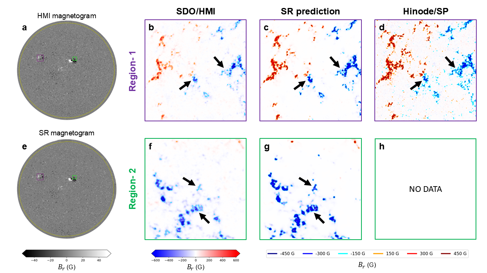

# HMI to Hinode/SP magnetogram reconstruction

Code and pretrained models for **Full-Disk Solar Magnetogram Reconstruction to Hinode/SP Resolution Using an Improved Arbitrary-Scale Super-Resolution Network**. **PM-LTEW-CC** is the primary model; model names follow Table 2.

## Full-disk applications

**Solar maximum — Figure 6**


**Solar minimum — Figure 7**



The [three full-disk cases](full-disk/README.md) include these results and the quiet-Sun example from the appendix, with HMI/SP inputs, saved reconstruction arrays and paper figures.

## Repository layout

| Folder | Contents |
|---|---|
| [`models/`](models) | Model architectures, including LTE-warp |
| [`pre-trained/`](pre-trained) | Six pretrained models and checksums |
| [`configs/`](configs) | Training and test configurations named by model |
| [`examples/`](examples) | Paired test data and existing predictions |
| [`full-disk/`](full-disk) | Three full-disk applications |
| [`magnetosr/`](magnetosr) | Python tools for download, preparation, training, inference, metrics and plotting |
| [`data/`](data) · [`docs/`](docs) | Dataset split, metadata and detailed instructions |

## Quick start

Python 3.10 or newer; run from the repository root:

```bash
git clone https://github.com/Rui-Zhuo/Magnetogram_SuperResol_by_ML.git
cd Magnetogram_SuperResol_by_ML
python -m pip install -e .
python -m magnetosr.inference --config configs/test_pm_ltew_cc.yaml
```

Inference defaults to CPU; add `--device cuda` for a CUDA-enabled PyTorch installation. Available models are **PM-LTEW-CC**, **PM-LTEW**, **LTEW-CC**, **LTEW**, **PM-RCAN-CC** and **PM-SRCNN-CC**. PM denotes position modulation; CC denotes the correlation-coefficient loss term. See [model configurations](configs/README.md).

The preparation pipeline downloads HMI/SP observations, aligns and crops them, and generates paired NPZ datasets. See [commands](docs/usage.md), [data preparation](docs/data_access.md) and [metric definitions](docs/metrics.md).

## Test example

One existing paired test result; its input, reference and saved prediction are included under `examples/`.


## Data and attribution

Example data, the dataset split and three full-disk results are included. The complete paired dataset will be archived separately.

Based on [LTEW](https://github.com/jaewon-lee-b/ltew) and [SOT/SP pointing updates](https://github.com/dfouhey/SOTSPPointing). Please cite the accompanying manuscript and upstream methods and data sources; see [attribution](third_party/README.md).
