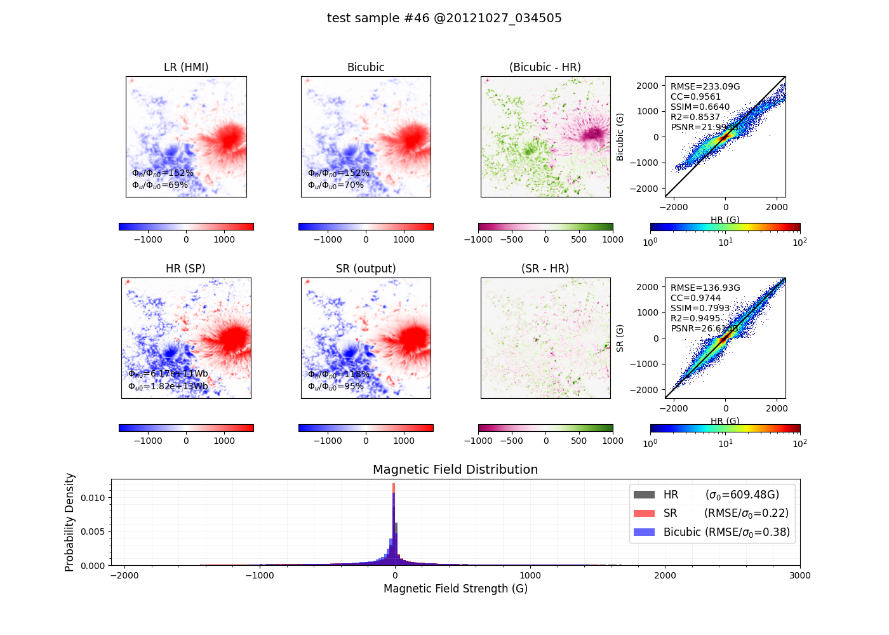
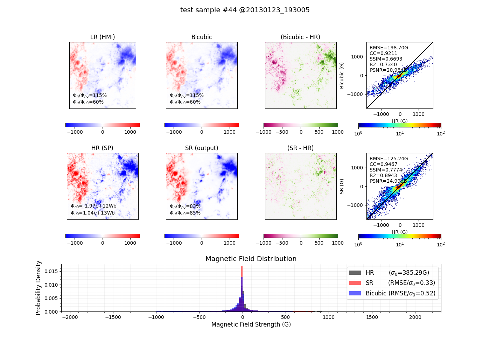
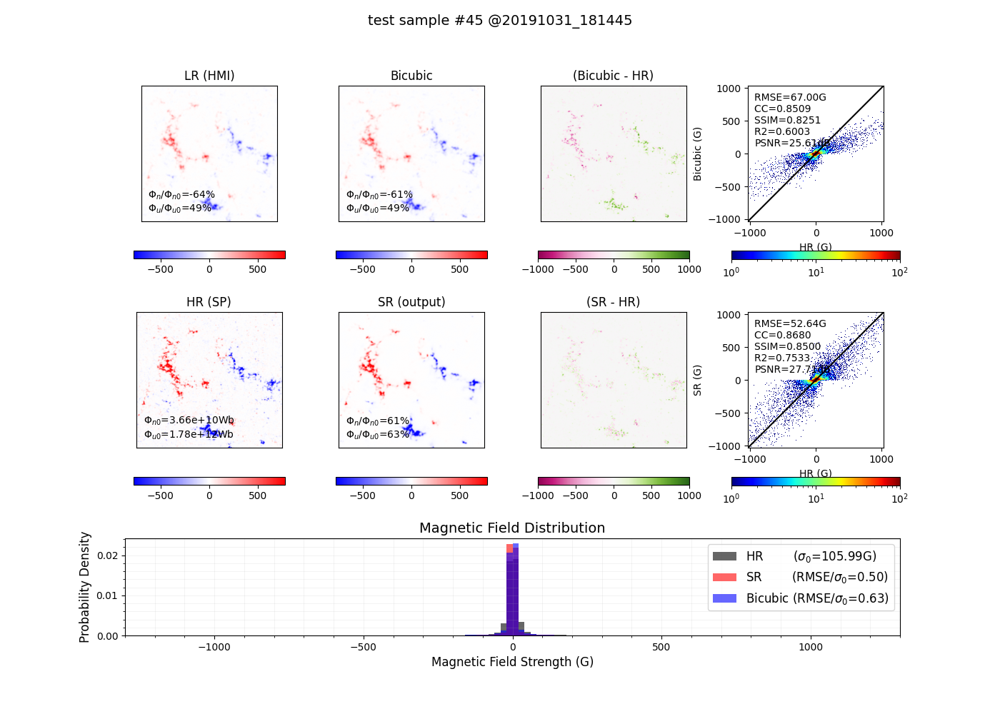

# HMI to Hinode/SP magnetogram reconstruction

Research code accompanying **Full-Disk Solar Magnetogram Reconstruction to Hinode/SP Resolution Using an Improved Arbitrary-Scale Super-Resolution Network**.

This repository provides data preparation, model definitions, training, pretrained inference weights, shared evaluation code, exact sample splits, and three held-out examples. The primary checkpoint is the **20260416 run, epoch 115**. Five additional checkpoints are ablation experiments. The paper calls the method PM-LTEW; the primary checkpoint's implementation is registered as `lte`, with a two-dimensional cell-size phase input.

**Release status:** code, weights and examples are available here. The complete paired dataset and full-disk derived products are **not included in this release** and will be archived separately. Examples and figures are the existing research outputs supplied with the project. See [implementation notes](docs/reproducibility.md) for the code conventions.

## Quick start

Python 3.10 or newer is required. Run these commands from the repository root:

```bash
git clone https://github.com/Rui-Zhuo/Magnetogram_SuperResol_by_ML.git
cd Magnetogram_SuperResol_by_ML
python -m venv .venv
# Linux/macOS: source .venv/bin/activate
# Windows PowerShell: .venv\Scripts\Activate.ps1
python -m pip install -e .
python -m magnetosr.inference --input examples/data --output outputs/predictions --device cpu
python -m magnetosr.evaluate --predictions outputs/predictions --data examples/data --output outputs/evaluation
python -m magnetosr.plot_samples --data examples/data --predictions outputs/predictions --output outputs/figures
```

CPU inference works; CUDA is recommended for training and large-scale inference. Install an appropriate CUDA-enabled PyTorch distribution if needed and use `--device cuda`. Query chunking (`--chunk-size 8192`) reduces inference memory. It preserves the full-query normalization used by the original model. The release checks and environment are recorded in [validation](docs/validation.json).

## Repository layout

| Location | Contents |
|---|---|
| `magnetosr/download.py`, `coalign.py`, `prepare.py`, `split.py` | Download, coarse alignment, local registration, crop, NPZ creation and new splits |
| `magnetosr/models/` | LTE/RCAN/MLP and fixed-grid ablation definitions |
| `magnetosr/train.py`, `inference.py` | Shared training and CPU/CUDA inference |
| `magnetosr/metrics.py`, `evaluate.py` | Metric definitions and auditable grouping |
| `magnetosr/legacy_metrics.py` | Original metric definitions for comparison |
| `configs/` | Portable training configurations and sanitised historical configurations |
| `checkpoints/` | Inference-only weights and SHA-256 provenance |
| `data/splits/`, `data/test_metadata.csv` | Exact train/validation/test split and test grouping |
| `examples/` | Three test pairs, existing predictions and figures |
| `docs/` | Data access, numerical conventions, limitations and validation |

## Data and units

Each paired NPZ contains:

| Key | Shape | Meaning |
|---|---|---|
| `HMIfield` | `(200, 200)` | HMI line-of-sight magnetic field, G |
| `SPfield` | `(312, 336)` | Aligned SP target field, G; the preparation code reads SP L2.1 HDU 4 |
| `Txy` | `(200, 200)` | Projected distance from disk centre, arcsec; **not an angle** |

Input channels are ordered `[HMIfield, Txy]`. Both channels and the training target are divided by 200. Predictions are multiplied by 200 to return to G. Height and width scale factors are 1.56 and 1.68. These factors describe **sampling**, not independently measured optical resolution. The meaning and FITS extension layout of any newly downloaded SP product must match the historical input product; do not substitute a different vector component.

The supplied split contains **10,115 samples: 6,069 training, 2,023 validation, 2,023 test**. The split file is the executable source of truth for this release. Preserve it when comparing models; do not randomly regenerate a split for each experiment. It is a sample-level split, not a guarantee of separation by active region or observing day.

## Prepare observations

Install the solar-data dependencies:

```bash
python -m pip install -e ".[solar]"
```

The sources are [SDO/JSOC HMI](http://jsoc.stanford.edu/), [HAO Hinode/SP](https://www2.hao.ucar.edu/csac/csac-instruments/sp), the [DARTS SP L2.1 mirror](https://darts.isas.jaxa.jp/en/datasets/darts%3Ahinode-sot-sp-level2.1-mirror/), and the [published SOT/SP pointing updates](https://github.com/dfouhey/SOTSPPointing). The latter's README links the corrected Level-2 metadata archive, including the affine coefficients and crop bounds required here. A pointing-table centre correction alone is insufficient for this pipeline. See [data access](docs/data_access.md).

```bash
python -m magnetosr.download sp --level 2 --output data/raw/sp_l2
python -m magnetosr.download sp --level 2.1 --output data/raw/sp_l21
python -m magnetosr.download hmi --email YOUR_REGISTERED_JSOC_EMAIL --output data/raw/hmi
python -m magnetosr.coalign --pointing data/raw/pointing --sp-l2 data/raw/sp_l2 --sp-l21 data/raw/sp_l21 --hmi data/raw/hmi --pairs data/raw/hmi/pairs.csv --output data/aligned
python -m magnetosr.prepare --input data/aligned --output data/paired --split data/splits/dataset_split_10115.json
```

Place all selected pointing FITS files directly in `data/raw/pointing/`, with names such as `20121027_034505.fits`; flatten the archive's year directories without renaming observation IDs. The downloader uses the split's IDs; `--limit 1` supports an initial download check. It obtains both SP data levels and selects the nearest HMI `hmi.M_720s` magnetogram within 360 seconds of the observation ID's UTC time, writing the selected filename and time offset to `pairs.csv`. This explicit nearest-record rule is a release improvement over the historical narrow-time query; the original per-observation HMI match logs would be required to guarantee identical raw-data selection.

Coarse alignment uses the published affine matrix, original slit positions, crop bounds and HMI WCS. The fine-alignment routine preserves the research implementation's local phase correlation (32-pixel window, step 1), spline displacement interpolation, cubic warping, central 200×200 crop and 312×336 resampling. It is **not a call to the external FLCT package**. Non-finite inputs and missing observations are reported explicitly. The preparation report records displacement statistics; no success is implied for failed records. Full archive downloads and a complete raw-to-dataset rebuild have not been run for this release.

For a new study only, generate a deterministic 60/20/20 split with:

```bash
python -m magnetosr.split --data data/paired --output data/splits/new_split.json --seed 42
```

## Pretrained models and ablations

The weight files omit optimizer state but preserve model tensors exactly. `checkpoints/manifest.json` records original run, epoch, source checksum and exported checksum. They are ordinary Git files, each below 100 MiB; no Git LFS or external account is needed to download them.

| Checkpoint | Run | Best epoch | Position modulation | Correlation weight |
|---|---:|---:|---|---:|
| `pm_lte.pth` | 20260416 | 115 | Historical LTE formula | 0.01 |
| `pm_lte_no_cc.pth` | 20260831 | 139 | Historical LTE formula | 0 |
| `lte_no_pm.pth` | 20260901 | 154 | Disabled | 0.01 |
| `lte_no_pm_no_cc.pth` | 20260902 | 81 | Disabled | 0 |
| `pm_rcan.pth` | 20260912 | 103 | Fixed-grid model's patch-centre formula | 0.01 |
| `pm_srcnn.pth` | 20260915 | 198 | Fixed-grid model's patch-centre formula | 0.01 |

The implementation details of position normalization are documented in [implementation notes](docs/reproducibility.md). Portable configurations use a shared schedule for new experiments; sanitised historical configurations document the existing runs.

```bash
python -m magnetosr.inference --checkpoint checkpoints/pm_rcan.pth --input examples/data --output outputs/pm_rcan
python -m magnetosr.train --config configs/train_pm_lte.yaml --data data/paired --output outputs/train_pm_lte --device cuda
```

Training uses AdamW, seed 42, batch size 6, learning rate 1e-4, and the original weighted loss `(1-w) * L1 + w * (1-CC)`. CC is calculated per sample with epsilon 1e-8 and clamped to [-0.999, 0.999]. Portable configurations share 300 epochs and milestones [200, 400, 600, 800], gamma 0.5. Historical configurations are supplied separately because some runs used different epoch limits or resumed training. Augmentation applies the original gated horizontal/vertical flips. `last.pth` supports `--resume`; exported pretrained checkpoints are for inference and do not contain optimizer state. No retraining was performed during release preparation.

## Evaluation

One evaluator works for every prediction directory. It writes per-sample CSV and group summaries with counts, means, population standard deviations and finite-value counts. Groups include all samples, AR-like/non-AR, and `sin(theta)` bins [0, 0.5), [0.5, 0.8), [0.8, 1]. The label is AR-like if the 99th percentile of `abs(HMI)` is at least 600 G; it is not a NOAA/HARP classification. Membership and historical angle values are supplied in `data/test_metadata.csv`.

MAE/RMSE are in G and also normalized by each reference map's standard deviation. Other metrics are Pearson CC, R², SSIM, historical PSNR, signed and unsigned flux ratios. Exact definitions and edge cases are in [metrics](docs/metrics.md). Flux agreement scores are computed **after averaging ratios**, matching the current statistics script. A general evaluator and explicit grouping are sufficient; duplicated plotting/statistics scripts for every model are unnecessary. These three examples are not a substitute for the complete test population.

## Test examples

The examples below are the existing test figures from the 20260416 experiment. The associated paired data and saved predictions are supplied in `examples/data/` and `examples/predictions/`; `examples/manifest.json` identifies their original filenames. Running inference writes new outputs to a separate directory.





## Limitations and data availability

This deterministic network provides no calibrated uncertainty intervals. LOS-only reconstruction is not a validated transverse/vector-field model. Near-limb foreshortening, temporal mismatch during SP raster acquisition, cross-instrument calibration, local-registration bias and weak internetwork fields limit quantitative interpretation. Increasing output sampling does not by itself establish improved optical resolution.

No full-disk product is distributed in this release. A future product archive must identify where the neural network was applied and where bicubic/off-limb fallback was used, provide its WCS, physical units and a machine-readable provenance mask, and state its uncertainty limitations. Such a mask must not be inferred merely from displayed pixel values. No DOI or full-data download URL is claimed before that separate archive exists.

## Validation and attribution

See [validation record](docs/validation.json) for the packaging and entry-point checks actually executed, and [release scope](docs/release_scope.md) for availability against the requested research materials.

The neural architecture derives from [LTEW](https://github.com/jaewon-lee-b/ltew), by Jaewon Lee, Kwang Pyo Choi and Kyong Hwan Jin (ECCV 2022), with upstream LIIF/RCAN lineage. The upstream BSD-3-Clause notice is retained in `third_party/LTEW-LICENSE.txt`. Please cite the accompanying manuscript, LTE/LTEW, the SOT/SP pointing-calibration publications, and the original HMI/SP archives as appropriate. This repository contains no private reviewer correspondence.
