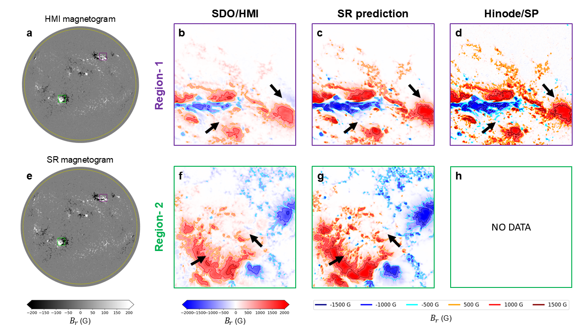

# HMI to Hinode/SP magnetogram reconstruction

Code and pretrained models for **Full-Disk Solar Magnetogram Reconstruction to Hinode/SP Resolution Using an Improved Arbitrary-Scale Super-Resolution Network**. Model names follow manuscript Table 2; **PM-LTEW-CC** is the primary model.

## Installation

Python 3.10 or newer. Run from the repository root:

```bash
git clone https://github.com/Rui-Zhuo/Magnetogram_SuperResol_by_ML.git
cd Magnetogram_SuperResol_by_ML
python -m pip install -e ".[solar]"
```

## Dataset preparation

The workflow downloads HMI/SP observations, aligns and crops them, and generates paired NPZ files. See [`prep-dataset/`](prep-dataset/README.md) for commands. Three paired examples and the exact train/validation/test split are included; the complete dataset will be archived separately.

## Models, training and inference

[`models/`](models) contains the architectures, [`pre-trained/`](pre-trained) the six pretrained models, and [`configs/`](configs/README.md) their training/test settings: **PM-LTEW-CC**, **PM-LTEW**, **LTEW-CC**, **LTEW**, **PM-RCAN-CC** and **PM-SRCNN-CC**. PM denotes position modulation; CC denotes the correlation-coefficient loss term. The LTEW variants share the LTE-warp implementation.

```bash
python -m training.train --config configs/train_pm_ltew_cc.yaml --data data/paired --output outputs/training --device cuda
python -m inference.predict --config configs/test_pm_ltew_cc.yaml
```

Inference defaults to CPU; add `--device cuda` for a CUDA-enabled PyTorch installation. Training requires the prepared dataset; the included examples are sufficient for inference.

## Evaluation and test example

[`evaluation/`](evaluation/README.md) contains one shared set of [metric definitions](docs/metrics.md), the evaluator and plotting tools.

```bash
python -m evaluation.evaluate --predictions outputs/pm_ltew_cc --data examples/data --output outputs/evaluation
```

Existing paired test result, with input, reference and saved prediction in `examples/`:


## Full-disk applications

[`full-disk/`](full-disk/README.md) provides the HMI download → patch inference → assembly → background filling → plotting workflow. [`examples/application/`](examples/application/README.md) contains the three paper-case previews and observation information. Large full-disk FITS/NPZ files are not included in the current tree.

**Solar maximum — Figure 6**



**Solar minimum — Figure 7**


The [quiet-Sun case](examples/application/quiet-sun/paper-figure.png) is shown in the appendix.

## Attribution

Based on [LTEW](https://github.com/jaewon-lee-b/ltew) and [SOT/SP pointing updates](https://github.com/dfouhey/SOTSPPointing). Please cite the accompanying manuscript, upstream methods and data sources; see [attribution](third_party/README.md) and [data access](docs/data_access.md).
